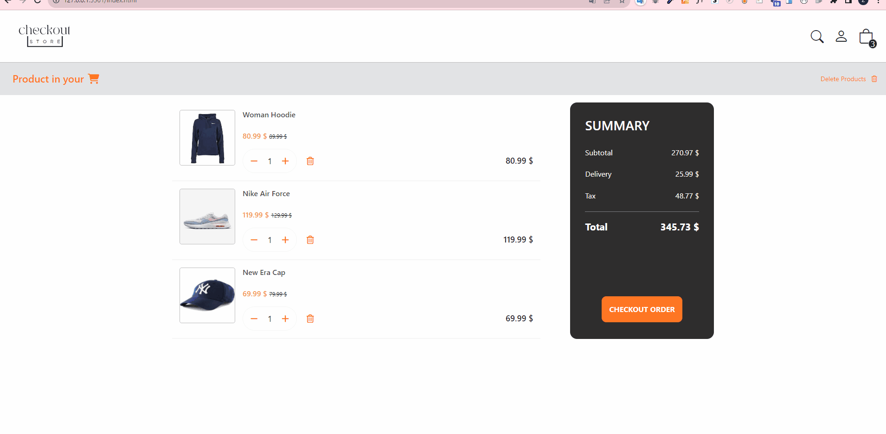

# checkout_page

## Description
✨ Project aims to create a basic checkout page of e-commerce website. 
✨ This is my first checkout page.

### Page structure
- Users can increase or decrease the number of products they add to their cart
- Users can delete the products they added to their cart.
- Users can delete all items in the cart at once

[checkout_page_live](https://zlhshn.github.io/checkout_page/)    

